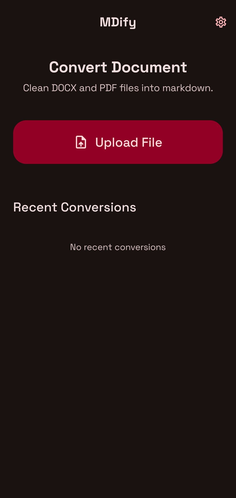
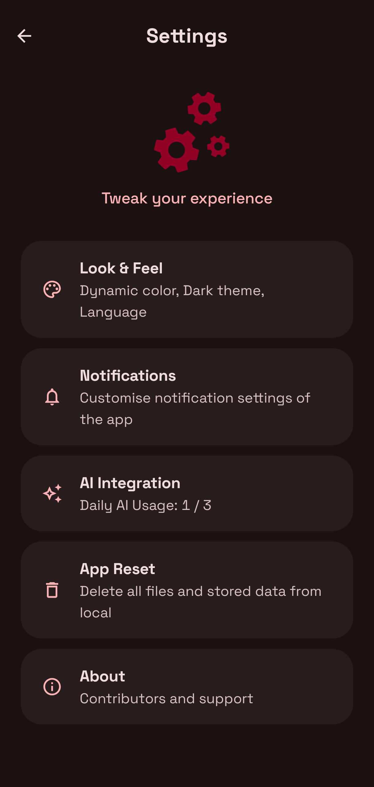
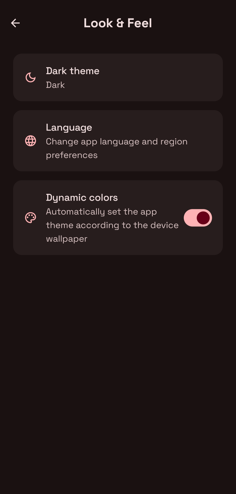
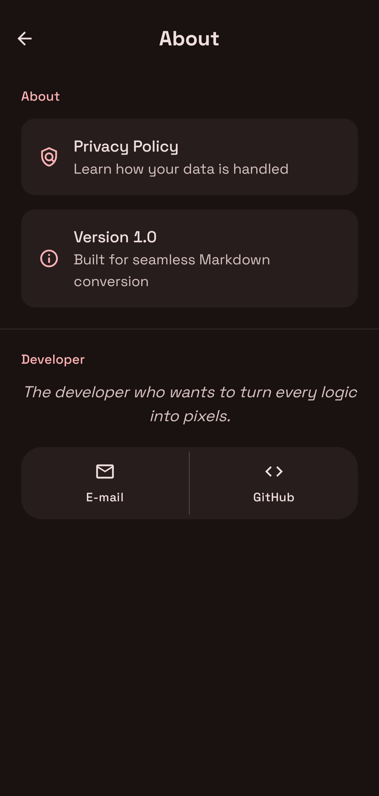

# MDify — Markdown Conversion Suite

> Convert DOCX and PDF to beautiful, editable Markdown with a premium, developer-focused UI.


[](https://example.com) [](LICENSE) [](https://nextjs.org) [](https://developer.android.com)

Premium UI • Dark Mode • Offline Conversion • High Fidelity Markdown

---

**Table of contents**
- Features
- Quick start
- UX & Design
- Project structure
- Build & deploy
- Contributing
- Roadmap
- License

---

## Features

- Elegant, minimal and modern interface inspired by Material 3 and developer tooling.
- Convert DOCX and PDF files to clean, standards-compliant Markdown (.md).
- Live Markdown preview with syntax highlighting and copy/share/export actions.
- Offline conversion support for privacy-first workflows.
- Batch conversion and recent files list for productivity.
- Dark-mode friendly, OLED-optimized themes with smooth animations.
- Designed for developers, writers, and knowledge workers (Obsidian, Notion friendly).

## UX & Design Highlights

- Minimal, card-based layout with rounded corners and soft shadows.
- Smooth, expressive animations for file upload and conversion progress.
- Typographic hierarchy tuned for readability in both light and dark themes.
- Subtle background motifs using Markdown symbols for a premium visual identity.
- Export workflows: copy to clipboard, save as `.md`, or share via OS share sheet.

## Screenshots
## Mdify 
<div align="center" style="display: flex; flex-direction: row; flex-wrap: wrap; gap: 10px; justify-content: center;">
  
  
</div>

## Mdify App
<div align="center" style="display: flex; flex-direction: row; flex-wrap: wrap; gap: 10px; justify-content: center;">
  
  
  
  
</div>


## Quick start

This repository contains two main projects:

- `mdify-web` — Next.js frontend and API for web conversion & preview.
- `mdify-app` — Native Android app (Kotlin + Jetpack Compose) for on-device conversion.

Web (development):

```bash
cd mdify-web
npm install
npm run dev
# Open http://localhost:3000
```

Web (build):

```bash
cd mdify-web
npm run build
npm run start
```

Android (development/build):

On Windows, use the included Gradle wrapper:

```powershell
cd mdify-app
./gradlew.bat assembleDebug
# or to install to a connected device/emulator:
./gradlew.bat installDebug
```

> Note: The Android app design brief and UI concepts are in `mdify-app/prompt.md`.

## Project structure

- `mdify-web/` — Mdify web app built with Next.js
	- `app/` — Next.js app routes and UI components.
	- `components/` — Reusable UI components and preview widgets.
	- `lib/converters/` — Converter implementations for PDF/DOCX.
- `mdify-app/` — Native Android app
	- `app/src/main/java` — Kotlin sources
	- `app/src/main/res` — layouts, themes, icons

## Converters & Privacy

- Conversion is performed locally when running the Android app.
- For the web, API endpoints can be configured to run conversion server-side or delegate to secure serverless functions — see `mdify-web/app/api/ai-cleanup/` for examples.
- No telemetry is collected by default. Add analytics only after user consent.

## Design Tokens & Branding

- Accent color: developer-friendly green with high contrast for accessibility.
- Motion: reduced-motion preferences are respected across the UI.
- Typography: modern sans-serif, clear heading scale, generous line height.

## Roadmap

- 1.0: Stable conversion core, polished UI, dark/light themes.
- 1.1: Batch conversion, cloud sync opt-in, CLI tool for batch jobs.
- 2.0: AI-enhanced smart conversions (preserve complex layouts), plugin integrations.

## Contributing

- Bug reports and feature requests: open an issue on the repo.
- For code contributions, fork the repo, create a feature branch, and open a pull request.
- Run linters and formatters before submitting; keep changes focused and well-documented.

## License

This project is licensed under the MIT License — see `LICENSE` for details.

## Contact & Support

- Project: MDify — Markdown Conversion Suite
- Maintainers: open for collaborators
- For commercial or design work, open an issue or contact via the repository profile.

---

Thank you for checking out MDify — let me know if you'd like a tailored README for the `mdify-web` subproject specifically, or if you want me to add example screenshots and a demo GIF.

